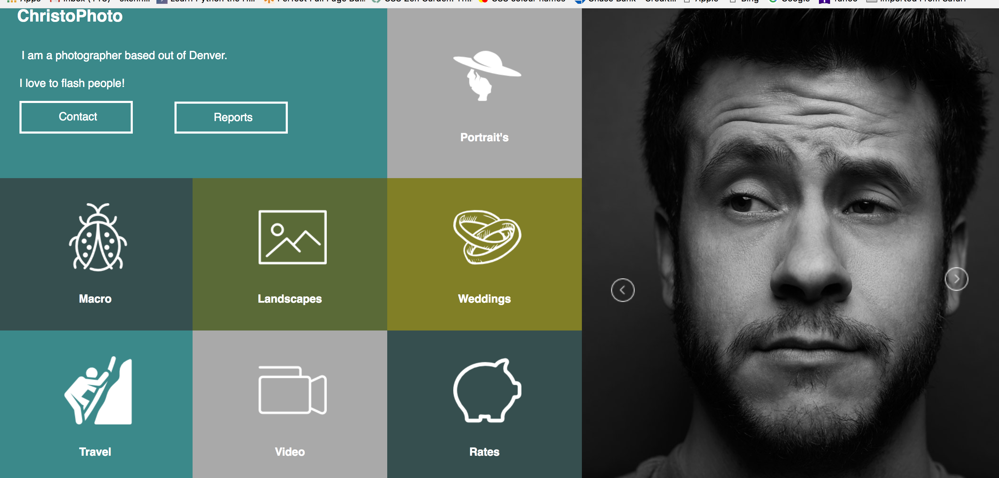
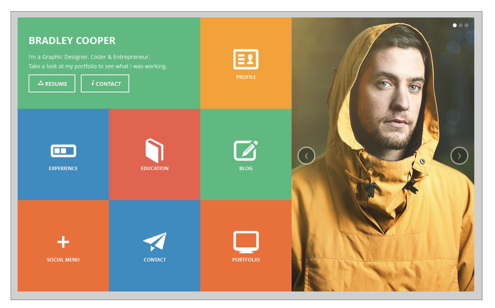

# static-comp-1
This project used CSS and HTML to make a static comp that required the use of flex-box to make the boxes responsive to the behavior
the movement of the site when it went to mobile form. I created this site by creating a main section that held 2 other sections within itself. The main section was given a flex display to make the 2 main corresponding sections work as rows that sit next to each other when it was a full size and moved to columns when at mobile. The section on the left that held all the smaller boxes
consists of 8 articles that were held within the parent element of the section. the section holding the articles was given a
display flex to control the movement of the articles and the articles we also were given a flex display to hold the content of the boxes into the center of the box. 

the challenge of the site was to look at close to the static comp provided below, I changed the icons to match the theme of the 
site along with the color scheme to match the tone of the site I created. 

